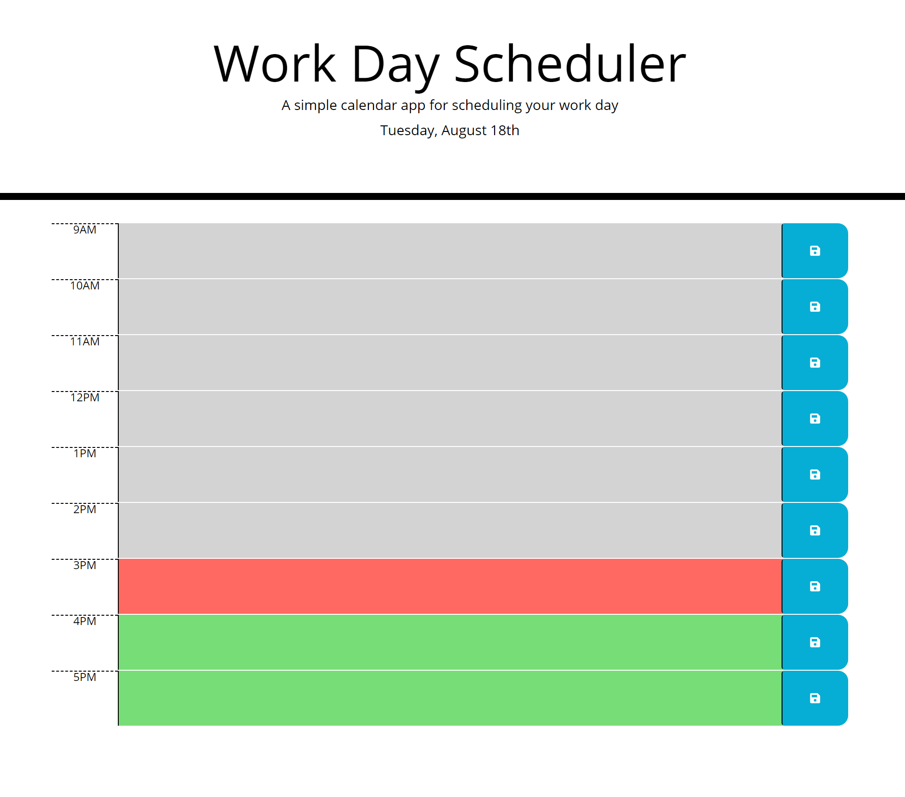
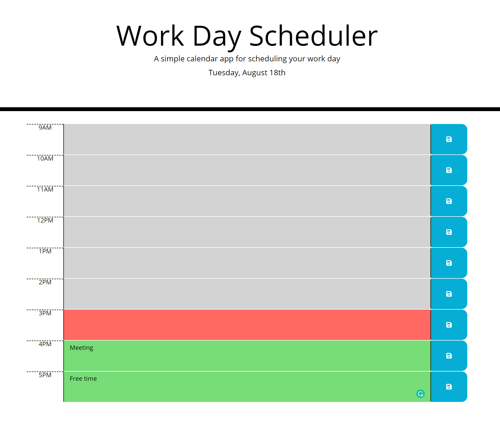

# 05 Third-Party APIs: Work Day Scheduler

A simple calendar application that allows the user to save events for each hour of the day. This app will run in the browser and feature dynamically updated HTML and CSS powered by jQuery.

Uses the [Moment.js](https://momentjs.com/) library to work with date and time.

## User Story

```
AS AN employee with a busy schedule
I WANT to add important events to a daily planner
SO THAT I can manage my time effectively
```





## Technologies Used

HTML, JavaScript, CSS, moment.js

## Deployed Application

https://joneskm72.github.io/day-scheduler-hw5/

## Contact

jones.m.kasey@gmail.com

## License

MIT